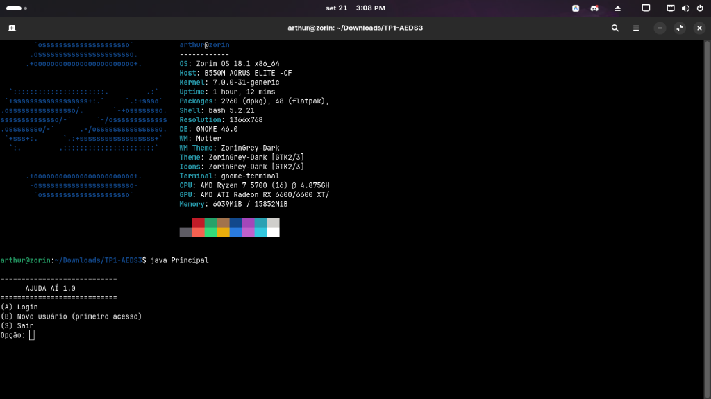
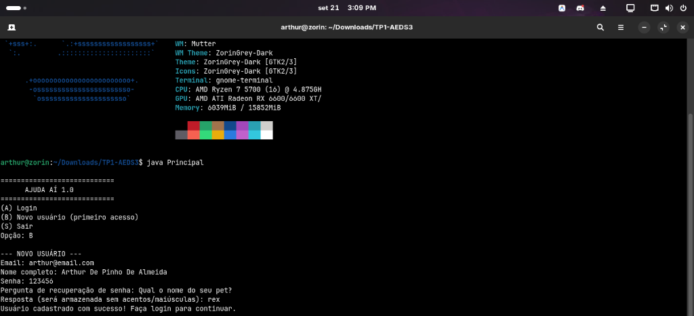
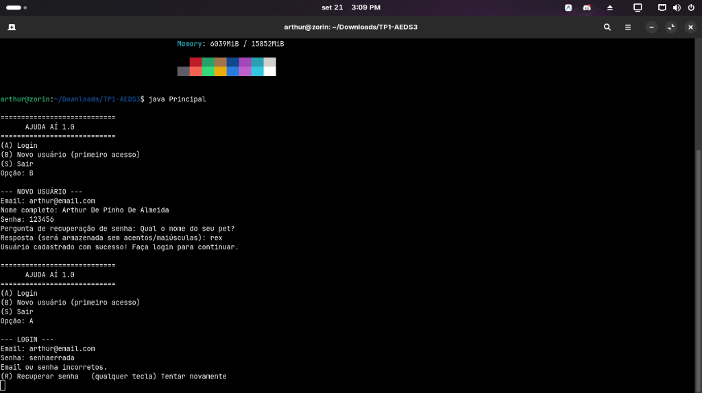
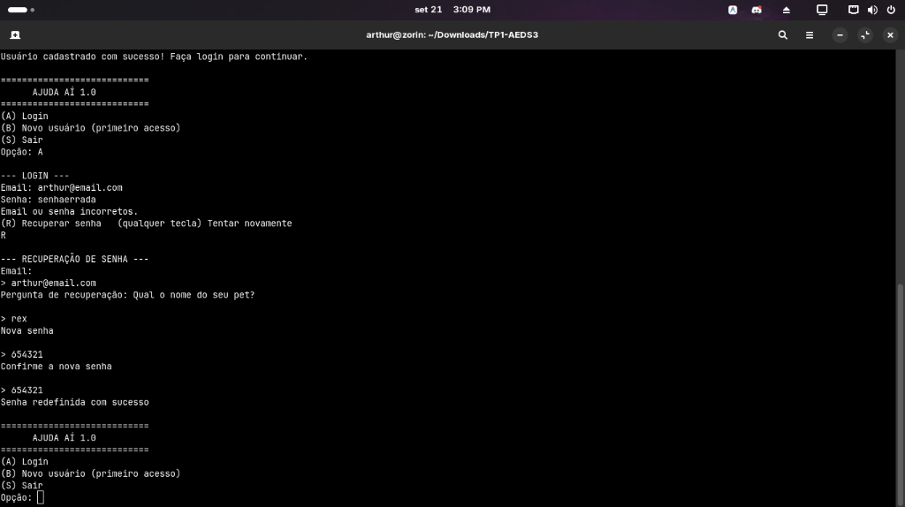
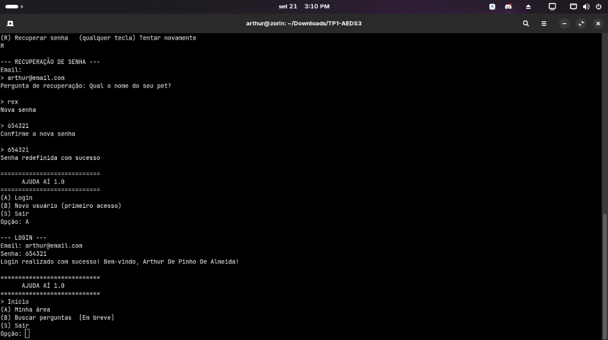
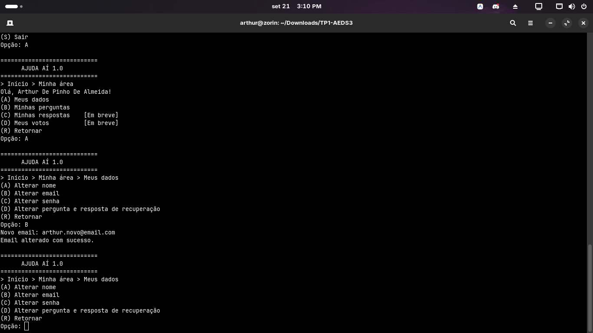
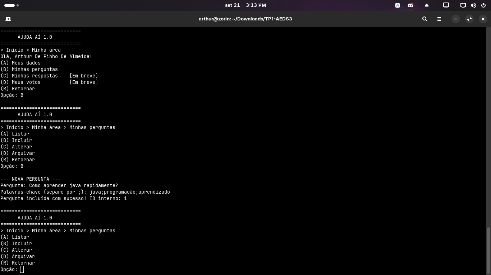
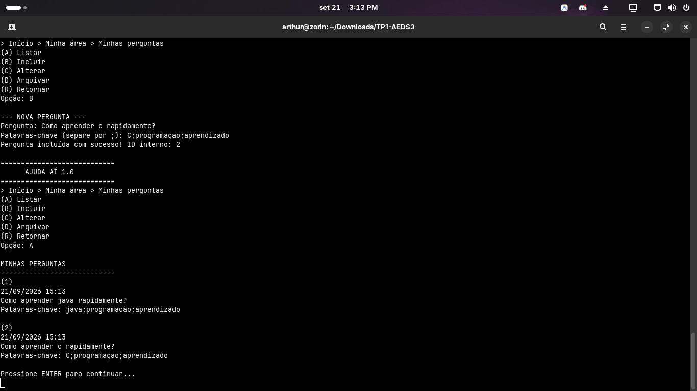
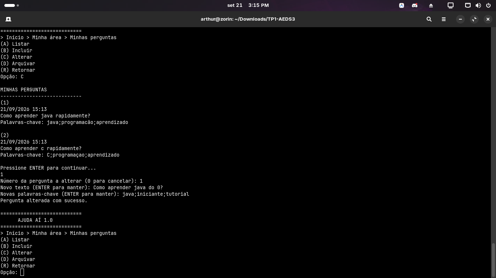
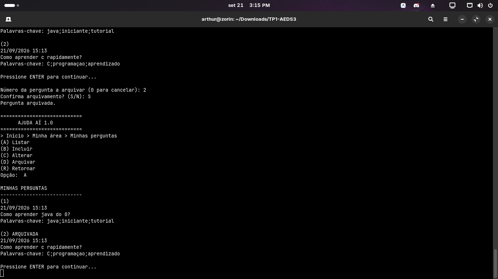

# Ajuda Aí 1.0 — TP1 AEDS III

Sistema de perguntas e respostas inspirado no StackOverflow, desenvolvido como primeiro trabalho prático da disciplina de Algoritmos e Estruturas de Dados III — PUC Minas.

---

## Participantes

| Nome                       | GitHub    |
|----------------------------|-----------|
| Arthur De Pinho De Almeida | imartzz   |
| Rafael Cardoso Machado     | icm3333   |
| —                          | —         |
| —                          | —         |

---

## Sobre o sistema

O **Ajuda Aí 1.0** é um sistema de terminal que permite o cadastro de usuários e a gestão de perguntas. Cada usuário cria sua conta com email, senha e uma pergunta de recuperação. Após o login, o usuário pode criar, listar, alterar e arquivar suas próprias perguntas.

O sistema utiliza **arquivos binários** para o armazenamento persistente dos dados, com índices auxiliares baseados em **Tabela Hash Extensível** (busca de usuário por email) e **Árvore B+** (relacionamento entre usuário e suas perguntas), seguindo as estruturas desenvolvidas em aula.

---

## Como compilar e executar

```bash
# Na raiz do projeto
javac -encoding UTF-8 aed3/*.java entidades/*.java controle/*.java visao/*.java Principal.java

java Principal
```

---

## Estrutura de classes

### Pacote `aed3/` — código base fornecido pelo professor

| Classe | Responsabilidade |
|---|---|
| `Arquivo<T>` | CRUD genérico sobre arquivo binário com cabeçalho (ultimoId + primeiroLivre) |
| `HashExtensivel` | Tabela Hash Extensível para índices de acesso direto |
| `ArvoreBMais` | Árvore B+ para índices de relacionamento e busca por intervalo |
| `ParIDEndereco` | Par (ID → endereço no arquivo) usado como índice primário |
| `ParIdId` | Par (ID1, ID2) para relacionamentos 1:N na Árvore B+ |
| `ParNomeId` | Par (String, ID) para índices secundários por texto |
| `InterfaceRegistro` | Interface que toda entidade persistível deve implementar |

### Pacote `entidades/` — entidades e seus CRUDs especializados

| Classe | Responsabilidade |
|---|---|
| `Usuario` | Entidade usuário: id, nome, email, hashSenha, perguntaSecreta, hashRespostaSecreta |
| `ArquivoUsuario` | Estende `Arquivo<Usuario>`, adiciona Hash Extensível por email para busca direta |
| `Pergunta` | Entidade pergunta: id, idUsuario, criacao, alteracao, nota, texto, palavrasChave, ativa |
| `ArquivoPergunta` | Estende `Arquivo<Pergunta>`, adiciona Árvore B+ com par (idUsuario, idPergunta) |
| `ParEmailId` | Par (hash do email → idUsuario) usado no índice Hash de usuários |

### Pacote `controle/` — lógica de negócio

| Classe | Responsabilidade |
|---|---|
| `ControleUsuario` | Login, cadastro, recuperação de senha, alteração de dados do usuário ativo |
| `ControlePergunta` | Criação, listagem, alteração e arquivamento de perguntas |

### Pacote `visao/` — telas do terminal

| Classe | Responsabilidade |
|---|---|
| `VisaoLogin` | Tela inicial: login, cadastro de novo usuário, recuperação de senha |
| `VisaoMenuPrincipal` | Menu pós-login: acesso à minha área e busca (em breve) |
| `VisaoMinhaArea` | Submenu: meus dados, minhas perguntas |
| `VisaoMeusDados` | Alterar nome, email, senha e pergunta de recuperação |
| `VisaoPerguntas` | Listar, incluir, alterar e arquivar perguntas |

### Raiz

| Classe | Responsabilidade |
|---|---|
| `Principal` | Ponto de entrada — inicializa os controles e dispara o fluxo de login |

---

## Telas do sistema

### Tela inicial



---

### Cadastro de novo usuário

O usuário informa email, nome, senha e uma pergunta/resposta de recuperação. O sistema valida se o email já existe antes de cadastrar.



---

### Login falhando e recuperação de senha

Ao errar a senha, o sistema oferece a opção de recuperar a conta via pergunta secreta. O usuário informa o email, responde à pergunta cadastrada (sem distinção de acentos/maiúsculas) e define uma nova senha com confirmação.





---

### Login correto e menu principal



---

### Minha área — Alterar email

Ao alterar o email, o sistema atualiza automaticamente o índice Hash Extensível, removendo a entrada antiga e inserindo a nova, garantindo a integridade do índice.



---

### Incluir perguntas



---

### Listar perguntas

As perguntas são numeradas sequencialmente. IDs internos não são exibidos. Perguntas arquivadas aparecem marcadas como `ARQUIVADA`.



---

### Alterar pergunta

O usuário seleciona a pergunta pelo número exibido na listagem. É possível alterar o texto e/ou as palavras-chave; o campo `alteracao` é atualizado automaticamente.



---

### Arquivar pergunta

O arquivamento é definitivo. A pergunta não é excluída do arquivo — apenas o atributo `ativa` é alterado para `false`. Ela continuará visível na listagem do autor, marcada como `ARQUIVADA`.



---

## Operações especiais

### Hash Extensível por email (`ArquivoUsuario`)

A busca de usuário por email é feita em **O(1)** sem varredura do arquivo principal. A classe `ArquivoUsuario` mantém um índice `HashExtensivel<ParEmailId>` onde a chave é o hash numérico do email (normalizado para minúsculas, sem acentos) e o valor é o `idUsuario`.

- **Inclusão:** ao criar um usuário, `create()` chama `super.create()` e em seguida insere o par no índice.
- **Busca:** `readByEmail(email)` consulta o hash, obtém o ID e lê o registro diretamente.
- **Alteração de email:** `update()` detecta mudança de email, remove a entrada antiga do hash e insere a nova, garantindo consistência.
- **Exclusão:** `delete()` remove a entrada do hash antes de marcar o registro como inválido.

### Árvore B+ com par `(idUsuario, idPergunta)` (`ArquivoPergunta`)

Para listar as perguntas de um usuário sem percorrer todo o arquivo, a classe `ArquivoPergunta` mantém uma `ArvoreBMais<ParIdId>` chamada `relUsuarioPergunta`.

- **Inclusão:** ao criar uma pergunta, o par `(idUsuario, idPergunta)` é inserido na árvore.
- **Listagem:** `readAllByUsuario(idUsuario)` busca todos os pares com aquele `idUsuario` na árvore e lê cada pergunta pelo ID.
- **Arquivamento:** operação lógica — apenas altera o campo `ativa` para `false` via `update()`, sem remover da árvore (a pergunta segue acessível ao autor).
- **Exclusão física:** `delete()` remove o par da árvore antes de marcar o registro como inválido.

### Exclusão em cascata (`ArquivoPergunta.deleteAllByUsuario`)

Ao excluir um usuário, todas as suas perguntas são excluídas em cascata. O método `deleteAllByUsuario(idUsuario)` busca todos os pares `(idUsuario, idPergunta)` na Árvore B+, exclui cada registro de pergunta e remove o par do índice, mantendo a integridade referencial.

---

## Checklist do enunciado

**1. Há um CRUD de usuários (com Hash Extensível) que funciona corretamente?**
> **Sim.** A classe `ArquivoUsuario` estende `Arquivo<Usuario>` e mantém um `HashExtensivel<ParEmailId>` para busca direta por email. Todas as operações (create, read, update, delete) atualizam o índice de forma consistente.

**2. Há um CRUD de perguntas (com Árvore B+) que funciona corretamente?**
> **Sim.** A classe `ArquivoPergunta` estende `Arquivo<Pergunta>` e mantém uma `ArvoreBMais<ParIdId>` para o relacionamento com o usuário. As operações de criação, leitura, atualização e arquivamento funcionam corretamente.

**3. As perguntas estão vinculadas aos usuários usando o `idUsuario` como chave estrangeira?**
> **Sim.** A entidade `Pergunta` possui o atributo `idUsuario`, que é preenchido automaticamente com o ID do usuário logado no momento da criação.

**4. Há uma Árvore B+ que registre o relacionamento 1:N entre usuários e perguntas?**
> **Sim.** O atributo `relUsuarioPergunta` em `ArquivoPergunta` é uma `ArvoreBMais<ParIdId>` que armazena pares `(idUsuario, idPergunta)`, permitindo a listagem eficiente de todas as perguntas de um usuário.

**5. O trabalho compila corretamente?**
> **Sim.** Compilado com `javac -encoding UTF-8` sem erros ou avisos.

**6. O trabalho está completo e funcionando sem erros de execução?**
> **Sim.** Todas as operações foram testadas: cadastro, login, recuperação de senha, alteração de dados do usuário, inclusão, listagem, alteração e arquivamento de perguntas. Nenhum erro de execução foi observado.

**7. O trabalho é original e não a cópia de um trabalho de outro grupo?**
> **Sim.** O projeto foi desenvolvido integralmente pelo grupo, utilizando como base apenas o código genérico fornecido pelo professor (`Arquivo`, `HashExtensivel`, `ArvoreBMais`).
